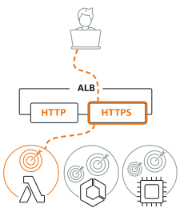
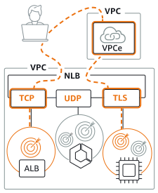
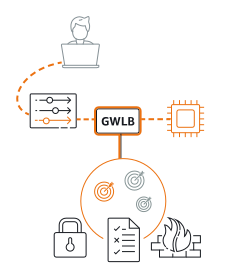

# AWS Services 
### Santhiya Notes

## Containers in AWS
Container management tools can be broken down into three categories: registry, orchestration, and compute.
## Compute
|Category             |Services                    |Description                                                   |
|---------------------|----------------------------|--------------------------------------------------------------|
|Instances(Virtul Machine)|Elastic cloud compute(EC2)   |  Provides secure, resizable compute capacity in the cloud. It makes web-scale cloud computing easier for developers. |
||EC2 spot| A Spot Instance is an instance that uses spare EC2 capacity that is available for less than the On-Demand price. Because Spot Instances enable you to request unused EC2 instances at steep discounts, you can lower your Amazon EC2 costs significantly. The hourly price for a Spot Instance is called a Spot price.-Run fault-tolerant workloads for up to 90% off|
||EC2 AutoScaling|Automa¬tically add or remove compute capacity to meet changes in demand|
||LightSail|Designed to be the easiest way to launch & manage a virtual private server with AWS. An easy-t¬o-use cloud platform that offers everything need to build an application or website.|
||Batch|Enables developers, scientists, & engineers to easily & effici¬ently run hundreds of thousands of batch computing jobs on AWS. Fully managed batch processing at any scale.|
||AWS Fargate|AWS Fargate is a serverless compute engine for containers. Fargate makes it easy for you to focus on building your applications.|

#   Storage
|  Service  |     Description                                           |
|-----------|-----------------------------------------------------------|
| AWS S3    |S3 is the storehouse for the internet i.e. object storage built to store & retrieve any amount of data from anywhere. https://aws.amazon.com/s3/?c=s&amp;sec=srv |
|AWS Backup |AWS Backup is an externally-accessible backup provider that makes it easier to align & optimize the backup of data across AWS services in the cloud. https://aws.amazon.com/backup/?c=s&amp;sec=srv             |
|Amazon EBS |Amazon Elastic Block Store is a web service that provides block-level storage volumes.                             https://aws.amazon.com/ebs/?c=s&amp;sec=srv                |
|Amazon EFS Storage |EFS offers file storage for the user’s Amazon EC2 instances. It's kind of blob storage. https://aws.amazon.com/efs/?c=s&amp;sec=srv                |
|Amazon FSx | FSx supply fully managed 3rd-party file systems with the native compatibility & characteristic sets for workloads. It's available as FSx for Windows server (Fully managed file storage built on Windows Server) & Lustre (Fully managed high-performance Server) & Lustre (Fully managed high-performance file system integrated with S3).                       https://aws.amazon.com/fsx/windows/?c=s&amp;sec=srv        https://aws.amazon.com/fsx/lustre/?c=s&amp;sec=srv         |
|AWS Storage Gateway |Storage Gateway is a service which connects an on-premises software appliance with cloud-based storage.              https://aws.amazon.com/storagegateway/?c=s&amp;sec=srv     |
|AWS Data Sync |DataSync makes it simple & fast to move large amounts of data online between on-premises storage & S3, EFS, or FSx for Windows File Server.  https://aws.amazon.com/datasync/?c=s&amp;sec=srv           |
|AWS Transfer Family |The Transfer Family provides fully managed support for file transfers directly into & out of S3.                       https://aws.amazon.com/aws-transfer-family/?c=s&amp;sec=srv|
|AWS Snow Family |Highly-secure, portable devices to collect & process data at the edge, and migrate data into and out of AWS. https://aws.amazon.com/snow/?c=s&amp;sec=srv               |

# Databases
| Database type  | Use cases       | Service       | Description                                |
|----------------|-----------------|---------------|--------------------------------------------|
| Relational | Traditional applications, ERP, CRM, e-commerce | Aurora, RDS, Redshift | RDS is a web service that makes it easier to set up, control, and scale a relational database in the cloud. https://aws.amazon.com/rds/aurora/?c=db&amp;sec=srv https://aws.amazon.com/rds/?c=db&amp;sec=srv https://aws.amazon.com/redshift/?c=db&amp;sec=srv |
| Key-value | High-traffic web apps, e-commerce systems, gaming applications | DynamoDB | DynamoDB is a fully administered NoSQL database service that offers quick and reliable performance with integrated scalability. https://aws.amazon.com/dynamodb/?c=db&amp;sec=srv |
| In-memory | Caching, session management, gaming leaderboards, geospatial applications | ElastiCache for Memcached & Redis | ElastiCache helps in setting up, managing, and scaling in-memory cache conditions. https://aws.amazon.com/elasticache/memcached/?c=db&amp;sec=srv https://aws.amazon.com/elasticache/redis/?c=db&amp;sec=srv |
| Document | Content management, catalogs, user profiles | DocumentDB | DocumentDB (with MongoDB compatibility) is a quick, dependable, and fully-managed database service that makes it easy for you to set up, operate, and scale MongoDB-compatible databases. https://aws.amazon.com/documentdb/?c=db&amp;sec=srv |
| Wide column | High scale industrial apps for equipment maintenance, fleet management, and route optimization | Keyspaces (for Apache Cassandra) | Keyspaces is a scalable, highly available, and managed Apache Cassandra–compatible database service. https://aws.amazon.com/keyspaces/?c=db&amp;sec=srv |
| Graph | Fraud detection, social networking, recommendation engines | Neptune | Neptune is a fast, reliable, fully managed graph database service that makes it easy to build and run applications that work with highly connected datasets. https://aws.amazon.com/neptune/?c=db&amp;sec=srv |
| Time series | IoT applications, DevOps, industrial telemetry | Timestream | Timestream is a fast, scalable, and serverless time series database service for IoT and operational applications that makes it easy to store and analyze trillions of events per day. https://aws.amazon.com/timestream/?c=db&amp;sec=srv |
| Ledger | Systems of record, supply chain, registrations, banking transactions | Quantum Ledger Database (QLDB) | QLDB is a fully managed ledger database that provides a transparent, immutable, and cryptographically verifiable transaction log owned by a central trusted authority. https://aws.amazon.com/qldb/?c=db&amp;sec=srv |

# Developer Tools
| Service        | Description                                                    |
|----------------|----------------------------------------------------------------|
| Cloud9 | Cloud9 is a cloud-based IDE that enables the user to write, run, and debug code. https://aws.amazon.com/cloud9/?c=dv&amp;sec=srv |
| CodeArtifact | CodeArtifact is a fully managed artifact repository service that makes it easy for organizations of any size to securely store, publish, & share software packages used in their software development process. https://aws.amazon.com/codeartifact/?c=dv&amp;sec=srv |
| CodeBuild | CodeBuild is a fully managed service that assembles source code, runs unit tests, & also generates artefacts ready to deploy. https://aws.amazon.com/codebuild/?c=dv&amp;sec=srv |
| CodeGuru | CodeGuru is a developer tool powered by machine learning that provides intelligent recommendations for improving code quality & identifying an application’s most expensive lines of code. https://aws.amazon.com/codeguru/?c=dv&amp;sec=srv |
| Cloud Development Kit | Cloud Development Kit (AWS CDK) is an open source software development framework to define cloud application resources using familiar programming languages. https://aws.amazon.com/cdk/?c=dv&amp;sec=srv |
| CodeCommit | CodeCommit is a version control service that enables the user to personally store & manage Git archives in the AWS cloud. https://aws.amazon.com/codecommit/?c=dv&amp;sec=srv |
| CodeDeploy | CodeDeploy is a fully managed deployment service that automates software deployments to a variety of compute services such as EC2, Fargate, Lambda, & on-premises servers. https://aws.amazon.com/codedeploy/?c=dv&amp;sec=srv |
| CodePipeline | CodePipeline is a fully managed continuous delivery service that helps automate release pipelines for fast & reliable app & infra updates. https://aws.amazon.com/codepipeline/?c=dv&amp;sec=srv |
| CodeStar | CodeStar enables to quickly develop, build, & deploy applications on AWS. https://aws.amazon.com/codestar/?c=dv&amp;sec=srv |
| CLI | AWS CLI is a unified tool to manage AWS services & control multiple services from the command line & automate them through scripts. https://aws.amazon.com/cli/?c=dv&amp;sec=srv |
 X-Ray | X-Ray helps developers analyze & debug production, distributed applications, such as those built using a microservices architecture. https://aws.amazon.com/xray/?c=dv&amp;sec=srv |

## Instance Pricing Model
|Instance type|pricing|
|-------------|-------|
|On-Demand|Billing by hour or second is applicable to users who do not need any upfront payment or long-term commitment.- For applications with Applications with short-term, spiky, or unpredictable workloads that cannot be interrupted.-For applications being developed or tested on Amazon EC2 for the first time.|
|Reserved Instance| - Up to 72% off the On-Demand price.- Customers that can commit to using EC2 over a 1- or 3-year term to reduce their total computing costs- For applications with steady state usage.- For applications that may require reserved capacity|
|Dedicated Host|Physical EC2 server dedicated for your use, up to 70% off the On-Demand price.-For customers who need to use existing server-bound software licenses, including Windows Server, SQL Server, SUSE Server etc.- or customers who need to meet compliance requirements.- With On-Demand instances, you pay for compute capacity by the hour or the second depending on which instances you run. No longer-term commitments |
|Spot instance|Up to 90% off the On-Demand price.- For applications that have flexible start and end times.- For applications that are stateless or fault-tolerant.|

## Resgitry
|Category             |Services                    |Description                                                   |
|---------------------|----------------------------|--------------------------------------------------------------|
|Container|Elastic Container Registry|Amazon Elastic Container Registry (Amazon ECR) is an AWS managed container image registry service that is secure, scalable, and reliable. Amazon ECR supports private repositories with resource-based permissions using AWS IAM. This is so that specified users or Amazon EC2 instances can access your container repositories and images. |
# Pricing for ECR
With Amazon ECR, you only pay for the amount of data you store in your repositories and for the data transfer from your image pushes and pulls. 

## Orchestration
|Category             |Services                    |Description                                                   |
|---------------------|----------------------------|--------------------------------------------------------------|
|Containers|Awazon Elastic Container Service | Amazon Elastic Container Service (Amazon ECS) is a fully managed container orchestration service that provides the most secure, reliable and scalable way to run containerized applications.|
||Amazon kubernet Service|Amazon Elastic Kubernetes Service (Amazon EKS) is a managed Kubernetes service that makes it easy for you to run Kubernetes on AWS and on-premises. Kubernetes is an open-source system for automating deployment, scaling, and management of containerized applications.|

3/27/2023

### Support plan

## Basic Support

The Basic Support plan is already available to all AWS customers by default and is free of charge. It also offers support for account and billing questions including requests for service limit increases.

Customer Service & Communities – You have 24×7 access to customer service, AWS documentation, whitepapers, and support forums.
AWS Trusted Advisor – This provides guidance on how to properly provision your AWS resources based on the best practices to further increase performance and improve the overall security of your cloud architecture. You are only provided access to the 7 core Trusted Advisor checks.
AWS Personal Health Dashboard – This is a personalized view of the health status of each AWS service that you currently have. It also provides an alert when your resources are impacted by an AWS-initiated activity.

||Developer|Business|Enterprise|
|-----|---------|--------|----------|
|uses case|Recommended if you are experimenting or testing in AWS|Recommended if you have production workloads in AWS|Recommended if you have business and/or mission critical workloads in AWS|
|AWS Trusted Advisor Best Practice Checks|Service quota and security checks|Full set of checks|
|Architectural Guidance|General|Contextual to your use-cases|Consultative review and guidance based on your applications|
|Technical Account Management |X|X|Designated Technical Account Manager (TAM) to proactively monitor your environment and assist with optimization.|
|Training |X|X|Access to online self-paced labs|
|Account Assistance |X|X|Concierge Support Team|
|Enhanced Technical Suppor|Business hours’ ‘ email access to Cloud Support Associates,Unlimited cases / 1 primary contact Prioritized responses on AWS re:Post|24×7 phone, email, and chat access to Cloud Support Engineers Unlimited cases / unlimited contacts (IAM supported) Prioritized responses on AWS re:Post|

### Load balancer

## Application Load Balancer 

Choose an Application Load Balancer when you need a flexible feature set for your applications with HTTP and HTTPS traffic. Operating at the request level, Application Load Balancers provide advanced routing and visibility features targeted at application architectures, including microservices and containers.

## Network Load Balancer 

Choose a Network Load Balancer when you need ultra-high performance, TLS offloading at scale, centralized certificate deployment, support for UDP, and static IP addresses for your applications. Operating at the connection level, Network Load Balancers are capable of handling millions of requests per second securely while maintaining ultra-low latencies.

## Gateway Load Balancer

Choose a Gateway Load Balancer when you need to deploy and manage a fleet of third-party virtual appliances that support GENEVE. These appliances enable you to improve security, compliance, and policy controls.

Create

# Hakans Notes

  |       Topic      |  Name  |
  |------------------|--------|
  |Security Lifecycle| Mustafa|
  |    Antivirus     |  Hakan |
  |       IDS        |  Goce  |
  |    Guard Duty    |Santhiya|

What is the definition of AntiVirus ??
Antivirus software, also known as anti-malware, is a computer program used to prevent, detect, and remove malware. Antivirus software was originally developed to detect and remove computer viruses, hence the name.
